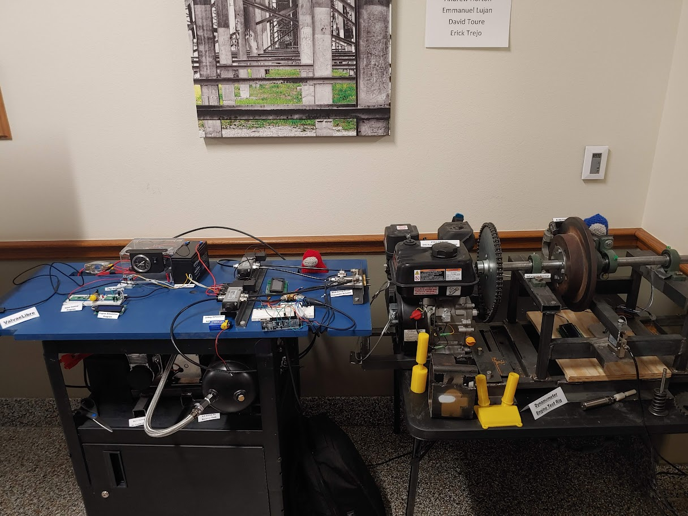

A collaborative senior capstone project done by Computer Science and Engineering students at [WTAMU](https://www.wtamu.edu/) in the spring of 2023.  
Replace the [camshaft](https://en.wikipedia.org/wiki/Camshaft) of an engine with a [Raspberry Pi Pico](https://www.raspberrypi.com/products/raspberry-pi-pico/), controlling some [solenoid](https://en.wikipedia.org/wiki/Solenoid) [actuators](https://en.wikipedia.org/wiki/Actuator).  

Computer Science team:  
* Jason Shick  
* Logan Pinter  
* Nichita Trifan  
* Julian Uy  
* Nickolas Gallegos  

Engineering team:
* Andrew Horton  
* Emmanuel Lujan  
* Erick Trejo  
* David Toure  

## Resources

* [Source code](https://github.com/uyjulian/ValvaeLibre)   
* [Camshaft UI](https://ghpages.uyjulian.pw/ValvaeLibre/src/html/camshaft.html)  
* Slides/User Manual/Documentation/Poster: Please [contact me](https://googlesite.uyjulian.pw/cm).  

[Go to the top of the page](#)  
[Return to top page](..)  
